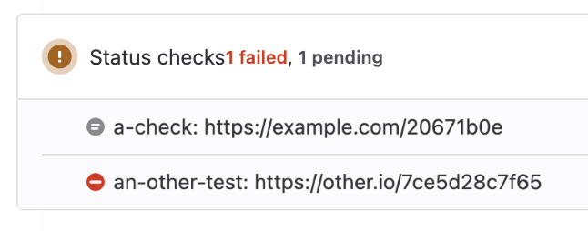

== External status checks

=== TL;DR

Tests for https://docs.gitlab.com/ee/api/status_checks.html



=== Usage

Check the `main(String... args)` method of the https://www.jbang.dev/[Jbang] script xref:ExternalStatusChecks.java[] and modify it.

The script is configured with a file `gitlab-config.properties` next to the script:

```properties
GITLAB_URL=https://gitlab.com
GITLAB_AUTH_VALUE=glpat-********************
GITLAB_PROJECT=121234
GITLAB_MR=6
```

* `GITLAB_URL` the gitlab ultimate URL
* `GITLAB_AUTH_VALUE` the access token
* `GITLAB_PROJECT` path or id of the project
* `GITLAB_MR` merge request iid in htat project

This is using PR https://github.com/gitlab4j/gitlab4j-api/pull/920[gitlab4j/gitlab4j-api#920] of the gitlab4j project.
