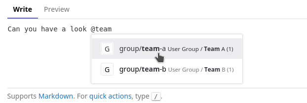

== Groups to model teams

Setup:

```
Gitlab root
└── User groups (path: `group`)
    ├── developers
    ├── marketing
    ├── presales
    ├── ...
    ├── qa
    ├── sre
    ├── team-a
    ├── team-b
    └── tech-writer
```

Those groups are intended to represent a team of users.
We use it only to manage members in those groups.

The groups are all *internal*, so that they are visible by any logged-in user and can be invited to other groups in the regular project structure.

Some configs:

* Wiki Disabled
* Roles allowed to create projects: *No one*
* Sub-group creation level: *Maintainer* (because "no one" is not possible for this)
* Membership `[x] Users can request access (if visibility is public or internal)`


And then in parallel to that, we have a group structure to manage the projects:

Something similar to the https://gitlab.com/tech-marketing/demos/gitlab-agile-demo/initech
[initech group] presented in some GitLab presentations.

```
Gitlab root
└── Initech
    ├── Billing & Fullfillment
    │   └── [REPO] Payment Gateway
    ├── Operations
    │   ├── [REPO] Infrastructure
    │   └── [REPO] Analytics
    ├── Student Education
    │   └── [REPO] Speed Run
    ├── Teacher Services
    │   ├── [REPO] Director Group
    │   ├── [REPO] Admissions Mngr
    │   ├── [REPO] Parent Portal
    │   ├── [REPO] Carpool
    │   └── [REPO] Report Card Manager
    ├── User Management
    │   ├── [REPO] SSO
    │   └── [REPO] User Management
    ├── [REPO] App A
    ├── [REPO] Templates Demo
    └── [REPO] Executive Leadership
```

=== Access Management

The idea is that the sub-groups from the `user-groups` group are invited to the group.

For example:

* `@group/team-a` has maintainer access to `Operations`
* `@group/team-a` has reporter access to `Teacher Services`
* `Teacher Services` is maintained by `@group/team-b` 


=== Code owners

The "users groups" are also used in code owners files inside each repo.


=== Mention

The "users groups" can be used to mention team members in issues.



== Open issues

=== 1) branch protection for specific group.

https://gitlab.com/gitlab-org/gitlab/-/issues/345140#note_125204934

If in the project `Initech/Operations/Infrastructure` you would like to set a specific branch protection rule for the group (for example they can push without any MR)
In the UI you can’t select the group (if it is only an indirect member of the project).

Using the REST API you get:

Request:
```http
POST /api/v4/projects/:project/protected_branches
```

Body:
```json
{
    "name": "main",
    "allowed_to_push": [
        { "group_id": 123 }
    ],
    "allowed_to_merge": [
        {"access_level": 30}
    ]
}
```

Response:
```json
{
    "message": [
        "Push access levels group does not have access to the project"
    ]
}
```

The workaround to be able to do this kind of config is to re-invite `@group/team-a` as member of each of the repos of `Initech/Operations`:
`Initech/Operations/Infrastructure`, `Initech/Operations/Analytics`

But this is not really what we would like to do.
Any idea?


=== 2) Seeing empty internal group

Since our user-groups are internal we would expect that everybody see those groups.

I did not really found the issue that captured our observation, currently those groups are visible to regular users when they navigate to the group. 
But they can not use those group to mention teams member.
They can also not invite one of those group (to a personal project for example).

Related issues:

* https://gitlab.com/gitlab-org/gitlab/-/issues/385455
* https://gitlab.com/gitlab-org/gitlab/-/issues/267996

The workaround is as follow:

* We have a `User Groups / All` where we have all the user present in one of the other user groups with a GUEST role.
* In each of the user-group sub groups we have a `do-not-use` archived project where the group `User Groups / All` is invited. This repository is configured to have the less options as possible (project is archived, minimal readme, no issues, no wiki, no-one allowed to push on the main branch...).

This can be achived with the script: xref:FixUserGroups.java[FixUserGroups.java]
