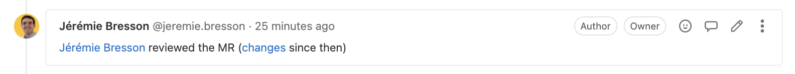
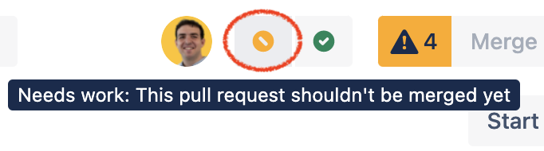
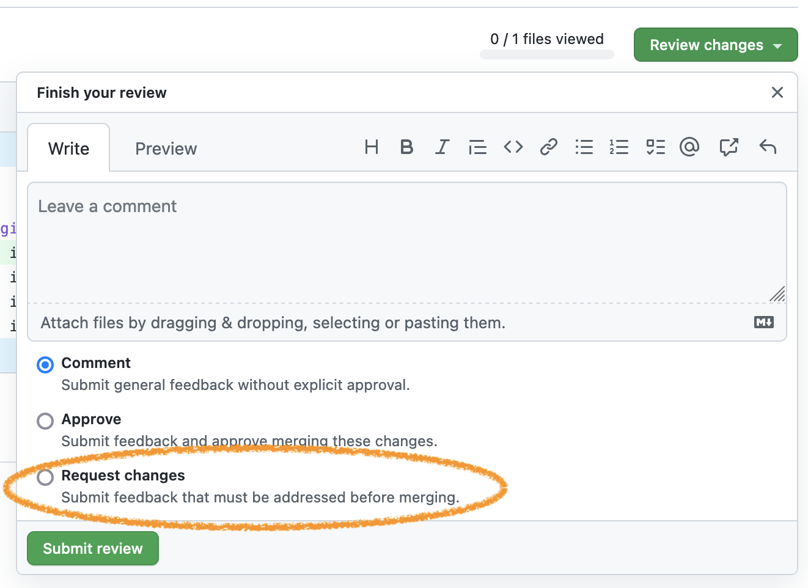
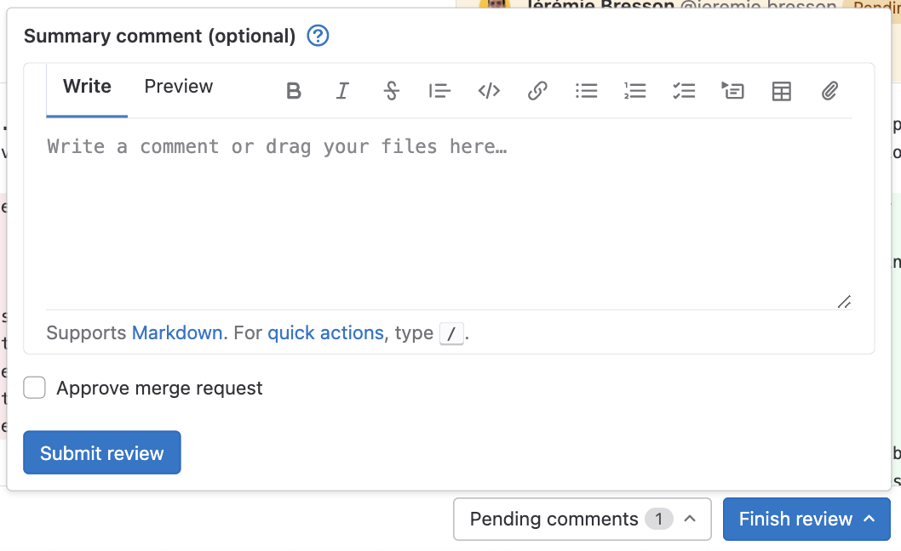
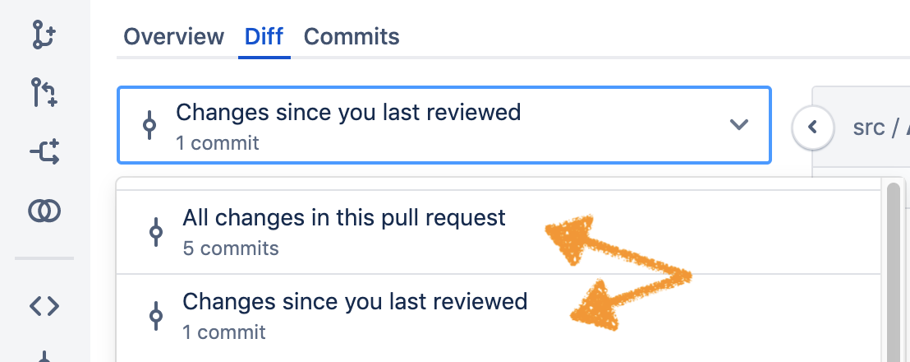

== Changes since last review on MR

=== TL;DR

This page describes how to add a comment to find the changes since the last review

https://www.jbang.dev/[Jbang] script: xref:AddReviewAtComment.java[]

=== Context

GitLab does not support sending a review with the request to perform changes.

In Bitbucket:

In GitHub:

Open issues in GitLab:

* https://gitlab.com/gitlab-org/gitlab/-/issues/234206[#234206 Add "Needs Work" state to merge requests]
* https://gitlab.com/gitlab-org/gitlab/-/issues/761[#761 Block merge request with a negative approval signal]

The current workaround is to submit a review without approving:

=== Problem

The problem is that when the reviewer comes back on the MR, he has to remember what was changed since his last review.

In Bitbucket this is nicely solved, by selecting the "changes since you last reviewed" option in the diff view:

=== Possible solution

GitLab (version `15.7.7-ee` at time of writting) supports comparing versions in the diff view.

The missing point is keeping track of the reviewed commit.
The proposed script xref:AddReviewAtComment.java[] helps keeping a record of the reviewed commit, by adding a comment.
This comment contains a link to `<mr-web-url>/diffs?start_sha=<reviewed-commit>` in order for the user to have a link "changes since then".

=== Outlook

It would be great to not have to trigger this logic from a CLI tool.

There is no webhook event emitted when when a review is filed.

=== See also

* https://gitlab.com/groups/gitlab-org/-/epics/1409[Epic #1409: Track unread diffs/files in Merge Requests]
