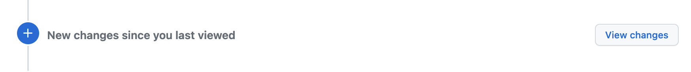

== Changes since last review on MR

=== TL;DR

This page describes how to add a comment to find the changes since the last review.

https://www.jbang.dev/[Jbang] script: xref:AddReviewAtComment.java[]

Corresponding GitLab issue: https://gitlab.com/gitlab-org/gitlab/-/issues/25559[#25559 "View changes since last review" link on MR]

NOTE: *UPDATE:* we came up with the same approach working as a bot that reacts on the https://docs.gitlab.com/ee/user/project/integrations/webhook_events.html#comment-events[Comment Webhook event] sent by GitLab: https://github.com/unblu/u-needs-work/[u-needs-work]

=== Context

GitLab does not support sending a review with the request to perform changes.

In Bitbucket:

In GitHub:

Open issues in GitLab:

* https://gitlab.com/gitlab-org/gitlab/-/issues/234206[#234206 Add "Needs Work" state to merge requests]
* https://gitlab.com/gitlab-org/gitlab/-/issues/761[#761 Block merge request with a negative approval signal]

The current workaround is to submit a review without approving:

=== Problem

The problem is that when the reviewer comes back on the MR, he has to remember what was changed since his last review.

In Bitbucket this is nicely solved, by selecting the "changes since you last reviewed" option in the diff view:

In GitHub there is a "view changes" button to acess the same diff:

=== Possible solution

GitLab (version `15.7.7-ee` at time of writting) supports comparing versions in the diff view.

The missing point is keeping track of the reviewed commit.
The proposed script xref:AddReviewAtComment.java[] helps keeping a record of the reviewed commit, by adding a comment.
This comment contains a link to `<mr-web-url>/diffs?start_sha=<reviewed-commit>` in order for the user to have a link "changes since then".

If you want a bot to post those comment, you can have a look at the https://github.com/unblu/u-needs-work/[u-needs-work] project.
It reacts at some keywords that can be added to the review comment.

=== See also

* https://gitlab.com/groups/gitlab-org/-/epics/1409[Epic #1409: Track unread diffs/files in Merge Requests]
